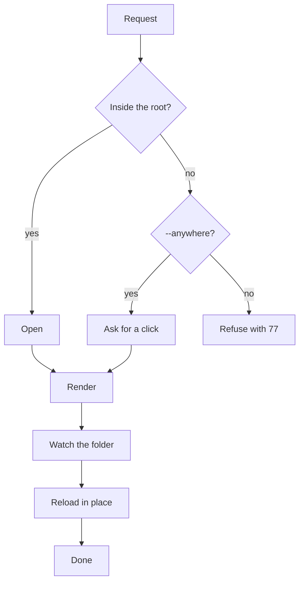

# Reader fixture plan

A synthetic 300-line plan for the reader's e2e spec and speed check. It has frontmatter, a diagram, a table,
a task list, a link to [the other document](other.md#part) and a local image.

## Overview

## Checklist

- [x] Resolve the path on disk
- [x] Check the projects root
- [ ] Render the page
- [ ] Follow the file

## Numbers

| Check | Target | Measured |
|---|---|---|
| Open | 200 ms | — |
| Reload | no flicker | — |

## Section 1

Paragraph 1: the reader shows this in the house style, with **bold**, `code` and a [fragment link](#overview).

Paragraph 2: the reader shows this in the house style, with **bold**, `code` and a [fragment link](#overview).

Paragraph 3: the reader shows this in the house style, with **bold**, `code` and a [fragment link](#overview).

Paragraph 4: the reader shows this in the house style, with **bold**, `code` and a [fragment link](#overview).

Paragraph 5: the reader shows this in the house style, with **bold**, `code` and a [fragment link](#overview).

Paragraph 6: the reader shows this in the house style, with **bold**, `code` and a [fragment link](#overview).

## Section 2

Paragraph 7: the reader shows this in the house style, with **bold**, `code` and a [fragment link](#overview).

Paragraph 8: the reader shows this in the house style, with **bold**, `code` and a [fragment link](#overview).

Paragraph 9: the reader shows this in the house style, with **bold**, `code` and a [fragment link](#overview).

Paragraph 10: the reader shows this in the house style, with **bold**, `code` and a [fragment link](#overview).

Paragraph 11: the reader shows this in the house style, with **bold**, `code` and a [fragment link](#overview).

Paragraph 12: the reader shows this in the house style, with **bold**, `code` and a [fragment link](#overview).

### Detail 3

Paragraph 13: the reader shows this in the house style, with **bold**, `code` and a [fragment link](#overview).

Paragraph 14: the reader shows this in the house style, with **bold**, `code` and a [fragment link](#overview).

Paragraph 15: the reader shows this in the house style, with **bold**, `code` and a [fragment link](#overview).

Paragraph 16: the reader shows this in the house style, with **bold**, `code` and a [fragment link](#overview).

Paragraph 17: the reader shows this in the house style, with **bold**, `code` and a [fragment link](#overview).

Paragraph 18: the reader shows this in the house style, with **bold**, `code` and a [fragment link](#overview).

## Section 4

Paragraph 19: the reader shows this in the house style, with **bold**, `code` and a [fragment link](#overview).

Paragraph 20: the reader shows this in the house style, with **bold**, `code` and a [fragment link](#overview).

Paragraph 21: the reader shows this in the house style, with **bold**, `code` and a [fragment link](#overview).

Paragraph 22: the reader shows this in the house style, with **bold**, `code` and a [fragment link](#overview).

Paragraph 23: the reader shows this in the house style, with **bold**, `code` and a [fragment link](#overview).

Paragraph 24: the reader shows this in the house style, with **bold**, `code` and a [fragment link](#overview).

## Section 5

Paragraph 25: the reader shows this in the house style, with **bold**, `code` and a [fragment link](#overview).

Paragraph 26: the reader shows this in the house style, with **bold**, `code` and a [fragment link](#overview).

Paragraph 27: the reader shows this in the house style, with **bold**, `code` and a [fragment link](#overview).

Paragraph 28: the reader shows this in the house style, with **bold**, `code` and a [fragment link](#overview).

Paragraph 29: the reader shows this in the house style, with **bold**, `code` and a [fragment link](#overview).

Paragraph 30: the reader shows this in the house style, with **bold**, `code` and a [fragment link](#overview).

### Detail 6

Paragraph 31: the reader shows this in the house style, with **bold**, `code` and a [fragment link](#overview).

Paragraph 32: the reader shows this in the house style, with **bold**, `code` and a [fragment link](#overview).

Paragraph 33: the reader shows this in the house style, with **bold**, `code` and a [fragment link](#overview).

Paragraph 34: the reader shows this in the house style, with **bold**, `code` and a [fragment link](#overview).

Paragraph 35: the reader shows this in the house style, with **bold**, `code` and a [fragment link](#overview).

Paragraph 36: the reader shows this in the house style, with **bold**, `code` and a [fragment link](#overview).

## Section 7

Paragraph 37: the reader shows this in the house style, with **bold**, `code` and a [fragment link](#overview).

Paragraph 38: the reader shows this in the house style, with **bold**, `code` and a [fragment link](#overview).

Paragraph 39: the reader shows this in the house style, with **bold**, `code` and a [fragment link](#overview).

Paragraph 40: the reader shows this in the house style, with **bold**, `code` and a [fragment link](#overview).

Paragraph 41: the reader shows this in the house style, with **bold**, `code` and a [fragment link](#overview).

Paragraph 42: the reader shows this in the house style, with **bold**, `code` and a [fragment link](#overview).

## Section 8

Paragraph 43: the reader shows this in the house style, with **bold**, `code` and a [fragment link](#overview).

Paragraph 44: the reader shows this in the house style, with **bold**, `code` and a [fragment link](#overview).

Paragraph 45: the reader shows this in the house style, with **bold**, `code` and a [fragment link](#overview).

Paragraph 46: the reader shows this in the house style, with **bold**, `code` and a [fragment link](#overview).

Paragraph 47: the reader shows this in the house style, with **bold**, `code` and a [fragment link](#overview).

Paragraph 48: the reader shows this in the house style, with **bold**, `code` and a [fragment link](#overview).

### Detail 9

Paragraph 49: the reader shows this in the house style, with **bold**, `code` and a [fragment link](#overview).

Paragraph 50: the reader shows this in the house style, with **bold**, `code` and a [fragment link](#overview).

Paragraph 51: the reader shows this in the house style, with **bold**, `code` and a [fragment link](#overview).

Paragraph 52: the reader shows this in the house style, with **bold**, `code` and a [fragment link](#overview).

Paragraph 53: the reader shows this in the house style, with **bold**, `code` and a [fragment link](#overview).

Paragraph 54: the reader shows this in the house style, with **bold**, `code` and a [fragment link](#overview).

## Section 10

Paragraph 55: the reader shows this in the house style, with **bold**, `code` and a [fragment link](#overview).

Paragraph 56: the reader shows this in the house style, with **bold**, `code` and a [fragment link](#overview).

Paragraph 57: the reader shows this in the house style, with **bold**, `code` and a [fragment link](#overview).

Paragraph 58: the reader shows this in the house style, with **bold**, `code` and a [fragment link](#overview).

Paragraph 59: the reader shows this in the house style, with **bold**, `code` and a [fragment link](#overview).

Paragraph 60: the reader shows this in the house style, with **bold**, `code` and a [fragment link](#overview).

## Section 11

Paragraph 61: the reader shows this in the house style, with **bold**, `code` and a [fragment link](#overview).

Paragraph 62: the reader shows this in the house style, with **bold**, `code` and a [fragment link](#overview).

Paragraph 63: the reader shows this in the house style, with **bold**, `code` and a [fragment link](#overview).

Paragraph 64: the reader shows this in the house style, with **bold**, `code` and a [fragment link](#overview).

Paragraph 65: the reader shows this in the house style, with **bold**, `code` and a [fragment link](#overview).

Paragraph 66: the reader shows this in the house style, with **bold**, `code` and a [fragment link](#overview).

### Detail 12

Paragraph 67: the reader shows this in the house style, with **bold**, `code` and a [fragment link](#overview).

Paragraph 68: the reader shows this in the house style, with **bold**, `code` and a [fragment link](#overview).

Paragraph 69: the reader shows this in the house style, with **bold**, `code` and a [fragment link](#overview).

Paragraph 70: the reader shows this in the house style, with **bold**, `code` and a [fragment link](#overview).

Paragraph 71: the reader shows this in the house style, with **bold**, `code` and a [fragment link](#overview).

Paragraph 72: the reader shows this in the house style, with **bold**, `code` and a [fragment link](#overview).

## Section 13

Paragraph 73: the reader shows this in the house style, with **bold**, `code` and a [fragment link](#overview).

Paragraph 74: the reader shows this in the house style, with **bold**, `code` and a [fragment link](#overview).

Paragraph 75: the reader shows this in the house style, with **bold**, `code` and a [fragment link](#overview).

Paragraph 76: the reader shows this in the house style, with **bold**, `code` and a [fragment link](#overview).

Paragraph 77: the reader shows this in the house style, with **bold**, `code` and a [fragment link](#overview).

Paragraph 78: the reader shows this in the house style, with **bold**, `code` and a [fragment link](#overview).

## Section 14

Paragraph 79: the reader shows this in the house style, with **bold**, `code` and a [fragment link](#overview).

Paragraph 80: the reader shows this in the house style, with **bold**, `code` and a [fragment link](#overview).

Paragraph 81: the reader shows this in the house style, with **bold**, `code` and a [fragment link](#overview).

Paragraph 82: the reader shows this in the house style, with **bold**, `code` and a [fragment link](#overview).

Paragraph 83: the reader shows this in the house style, with **bold**, `code` and a [fragment link](#overview).

Paragraph 84: the reader shows this in the house style, with **bold**, `code` and a [fragment link](#overview).

### Detail 15

Paragraph 85: the reader shows this in the house style, with **bold**, `code` and a [fragment link](#overview).

Paragraph 86: the reader shows this in the house style, with **bold**, `code` and a [fragment link](#overview).

Paragraph 87: the reader shows this in the house style, with **bold**, `code` and a [fragment link](#overview).

Paragraph 88: the reader shows this in the house style, with **bold**, `code` and a [fragment link](#overview).

Paragraph 89: the reader shows this in the house style, with **bold**, `code` and a [fragment link](#overview).

Paragraph 90: the reader shows this in the house style, with **bold**, `code` and a [fragment link](#overview).

## Section 16

Paragraph 91: the reader shows this in the house style, with **bold**, `code` and a [fragment link](#overview).

Paragraph 92: the reader shows this in the house style, with **bold**, `code` and a [fragment link](#overview).

Paragraph 93: the reader shows this in the house style, with **bold**, `code` and a [fragment link](#overview).

Paragraph 94: the reader shows this in the house style, with **bold**, `code` and a [fragment link](#overview).

Paragraph 95: the reader shows this in the house style, with **bold**, `code` and a [fragment link](#overview).

Paragraph 96: the reader shows this in the house style, with **bold**, `code` and a [fragment link](#overview).

## Section 17

Paragraph 97: the reader shows this in the house style, with **bold**, `code` and a [fragment link](#overview).

Paragraph 98: the reader shows this in the house style, with **bold**, `code` and a [fragment link](#overview).

Paragraph 99: the reader shows this in the house style, with **bold**, `code` and a [fragment link](#overview).

Paragraph 100: the reader shows this in the house style, with **bold**, `code` and a [fragment link](#overview).

Paragraph 101: the reader shows this in the house style, with **bold**, `code` and a [fragment link](#overview).

Paragraph 102: the reader shows this in the house style, with **bold**, `code` and a [fragment link](#overview).

### Detail 18

Paragraph 103: the reader shows this in the house style, with **bold**, `code` and a [fragment link](#overview).

Paragraph 104: the reader shows this in the house style, with **bold**, `code` and a [fragment link](#overview).

Paragraph 105: the reader shows this in the house style, with **bold**, `code` and a [fragment link](#overview).

Paragraph 106: the reader shows this in the house style, with **bold**, `code` and a [fragment link](#overview).

Paragraph 107: the reader shows this in the house style, with **bold**, `code` and a [fragment link](#overview).

Paragraph 108: the reader shows this in the house style, with **bold**, `code` and a [fragment link](#overview).

## Section 19

Paragraph 109: the reader shows this in the house style, with **bold**, `code` and a [fragment link](#overview).

The end of the plan.
